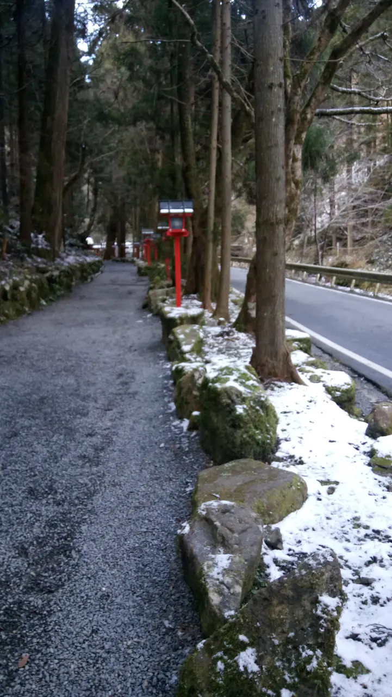
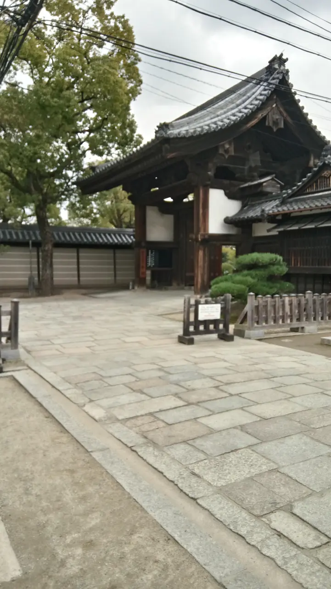

首po獻給旅遊版和我熱愛的日本～

自從大二寒假第一次去日本自由行後，就愛上了在日本自助旅行的氛圍！
去年暑假爸媽和弟弟拋下要實習的我，購買旅行社的自由行飛去關西玩了QQ疼女兒的爸爸不忍心寶貝女兒沒去過關西，因此答應今年寒假只要有朋友同行，願意幫我出旅費去關西六天五夜（爸爸我愛你！！！）

於是我就和高中好友兩人，在考完期末考的隔天一起飛往關西囉～

旅遊日期：2016/01/16（六）-2016/01/21（四）

我們購買旅行社的機+酒行程，機票和住宿都是固定的，所以只有做每日行程和必買伴手禮的功課，認真規劃大約是從前一年的11月開始
因為我喜歡大阪、好友喜歡京都，所以Day1、Day2是由我安排大阪行程，Day3、Day4是好友負責京都行程，Day5各自血拼，Day6參觀完跳蚤市場後前往機場搭機回台

行程的安排如下：

Day1

日本時間下午四點多抵達關西

→在機場內購買大阪周遊卡二日券

→在JR綠色窗口購買Haruka+icoca來回套票

→住宿於新大阪車站飯店（位於新大阪站東口）

房間長這樣

check in放完行李已經晚上6點左右了，在飯店旁的彌生軒填飽肚子後，就開始大阪的冒險～

雖然第一天就使用大阪周遊卡很浪費，但我們是以方便和不虧本為前提，只要交通+玩樂設施可以超過3000yen就OK！

首先第一站是梅田藍天大廈展望臺

夜景超美！！！
可是冬天風超大，整個超冷><

Hep Five摩天輪

紅色的造型非常特別

從摩天輪上看大阪的夜景也別有一番風味～

Day2
身為超級棒球迷的我
早上先到了甲子園棒球場參觀

我們有先在臺灣預約當天的導覽行程
雖然我完全不懂日文，但能夠讓我看看球場就足夠讓我興奮好久了！！！！

球場導覽結束後還可以參觀甲子園歷史博物館

是KANO的吳波！！！

下午到了大阪城公園
準備搭乘冬季限定的水上巴士，結果因為太晚領票，剩餘的票只能搭一小段，不能搭完全程一整圈，而且我們想搭的班次早就沒了，安排好的行程完全被打亂Q

當下只好改成先去逛天守閣，再回來搭水上巴士，大阪城公園的美景只能匆匆掠過

由於水上巴士只能搭一段就下船，我們在淀屋橋站下船後就搭地鐵前往難波
先領完道頓堀水上觀光船的票再去覓食，吃完晚餐剛好搭船～
以下為乘船看到的景色

搭完船後就是逛街時間啦！
由於購物安排在Day5，所以今天只是先稍微逛一逛，想好Day5要下手的目標XD
但當天好友還是在jins配了兩付眼鏡

Day3
結束大阪行程後，Day3搭乘JR京都線抵達京都車站，再轉車到了嵐山
我們會先玩嵐山，主要是因為我們要去比較少臺灣人去的西芳寺（苔寺）
到了嵐山之後我們租了腳踏車，從嵐電嵐山站騎到西芳寺去
由於每天有限定參拜人數，所以要參拜前2個月必須從臺灣先寄信預約，收到回信確定預約成功才可以去哦！

裡面非常非常美，放眼望去都是療癒的綠色，但是要參觀西芳寺的庭園之前，要先跟著住持念經，才能自由活動！

離開西芳寺後就騎回嵐山的鬧區逛逛渡月橋、逛逛街、吃抹茶冰淇淋、泡足湯～

Day4
今天一樣是京都行程
早上我們先到了京都大學參觀

中午吃了他們的學生餐廳（本行程的重點XD）
由於找不到我拍的食物照片，只能給大家看看餐廳排隊景象

離開京大之後，下午搭乘私鐵前往貴船參觀貴船神社

在貴船口車站遇到飄雪真的很興奮！！！

聽說晚一點去會看到神社的燈全部打開，會非常美麗，這次有點可惜沒機會看到><

Day5
瘋狂購物日
我和好友兩人分開，她去京都買她要的，我自己在大阪梅田、心齋橋血拼。
我在梅田的Yodobashi買了Panasonic吹風機，不是網路上或藝人超推的那隻，那隻太貴了我買不起QQ
但這隻我也很喜歡，顏色很美～

燈光為黃光，手機照相功能沒有很好，可能看不太出來顏色是玫瑰金><

其餘的戰利品就是大家都會買的藥妝，我所有的藥妝都是在心齋橋的大國藥妝買的，還有梅田的uniqlo也是我敗家的好所在～

Day6
返國日
我們是搭下午4點的飛機回臺灣，所以早上退房後，拖著行李箱來到天王寺站找置物櫃，走到四天王寺去參觀跳蚤市場
由於這個跳蚤市場是有特定日期的，我們在日本的時間剛好只有Day6重疊，於是就來啦～
但很可惜沒有比較清楚的攤位照片
好友在這裡發現很多便宜又愛不釋手的二手物！

這裡逛完以後就回到天王寺站搭乘Haruka到關西機場囉～

以上是簡易的京阪旅遊冬季篇介紹，會叫冬季篇是因為今年暑假我又和室友共四人一起到關西自由行了><
打一篇好久好累QQ，如果大家捧場我再考慮把夏季篇po上來和大家分享囉！

-不會日語卻愛日旅的女子